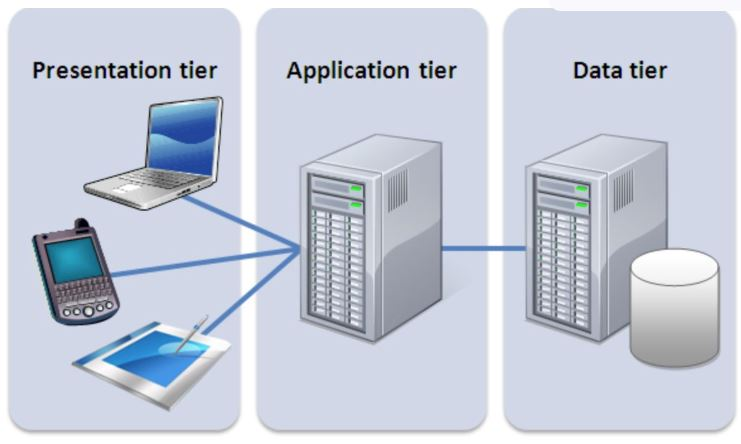
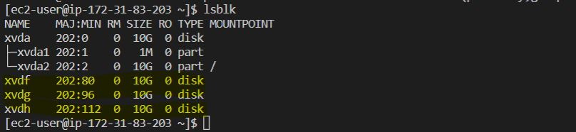
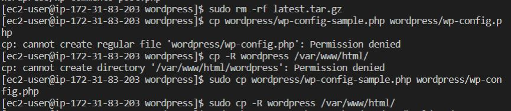

## Project - 6- Web Solution with Wordpress ##

WordPress is a free and open-source content management system written in PHP and paired with MySQL or MariaDB as its backend Relational Database Management System (RDBMS).

This Project consists of two parts:

1. Configure storage subsystem for Web and Database servers based on Linux OS. The focus of this part is to give you practical experience of working with disks, partitions and volumes in Linux.

2. Install WordPress and connect it to a remote MySQL database server. This part of the project will solidify your skills of deploying Web and DB tiers of Web solution.


## Three-tier Architecture ##
Generally, web, or mobile solutions are implemented based on what is called the Three-tier Architecture.

Three-tier Architecture is a client-server software architecture pattern that comprise of 3 separate layers.



1. Presentation Layer (PL): This is the user interface such as the client server or browser on your laptop.
2. Business Layer (BL): This is the backend program that implements business logic. Application or Webserver
3. Data Access or Management Layer (DAL): This is the layer for computer data storage and data access. Database Server or File System Server such as FTP server, or NFS Server.

The connectivity procedure are;
1. A Laptop or PC to serve as a client.
2. An EC2 Linux Server as a web server (This is where you will install WordPress).
3. An EC2 Linux server as a database (DB) server.

### Step 1 —  LAUNCH AN EC2 INSTANCE THAT WILL SERVE AS “WEB SERVER by preparing a Web Server. ###
-Launch an EC2 instance that will serve as "Web Server" using Redhat OS.


- Create 3 volumes in the same availability zone as your Web Server EC2, each of 10 GiB.


- Attach all three volumes one by one to your Web Server EC2 instance you created. Please ensure that the availability zones are same.


-Launch instance and SSH into the terminal. Use ``lsblk`` command to inspect what block devices are attached to the server. All devices in Linux reside in /dev/ directory. Inspect it with ls /dev/ and files name will be `xvdf, xvdh, xvdg`. 


You can use command ``df -h`` to view the all mounts and free spaces on your server.


- Use `gdisk` utility to create a single partition on each of the 3 disks `xvdf, xvdh, xvdg`.
```
sudo gdisk /dev/xvdf
```

 Note: You need to repeat this for each of the xvdf, xvdg, xvdh voulmes using hex code '8E00'.

 - Use `lsblk` utility to view the newly configured partition on each of the 3 disks.
 

 - Install *lvm2* package using the below command; 
 ```
 sudo yum install lvm2
 ```

 - Run the below command to check for available partitions.
 ```
 sudo lvmdiskscan
 ``` 


- Use ``pvcreate`` utility to mark each of 3 disks as physical volumes (PVs) to be used by LVM.
```
sudo pvcreate /dev/xvdf1
sudo pvcreate /dev/xvdg1
sudo pvcreate /dev/xvdh1
```


- Verify that your Physical volume has been created successfully by running below command;
```
sudo pvs
```


- Use ``vgcreate`` utility to add all 3 PVs to a volume group (VG). Name the VG webdata-vg. Verify that your VG has been created successfully by running ``sudo vgs``

```
sudo vgcreate webdata-vg /dev/xvdh1 /dev/xvdg1 /dev/xvdf1
sudo vgs
```


- Use `lvcreate` utility to create 2 logical volumes. apps-lv(website data storage) and logs-lv(log data storage)
```
sudo lvcreate -n apps-lv -L 14G webdata-vg
sudo lvcreate -n logs-lv -L 14G webdata-vg
```


- Verify that your Logical Volume has been created successfully.
```
sudo lvs
```
 

 - Verify the entire setup
 ```
sudo vgdisplay -v #view complete setup - VG, PV, and LV
sudo lsblk
```


- Use ``mkfs.ext4`` to format the logical volumes with `ext4` filesystem.
```
sudo mkfs -t ext4 /dev/webdata-vg/apps-lv
sudo mkfs -t ext4 /dev/webdata-vg/logs-lv
```


- Create `/var/www/html` directory to store website files and create `/home/recovery/logs` to store backup of log data, then Mount `/var/www/html` on apps-lv logical volume. afterwards, Use ``rsync`` utility to backup all the files in the log directory `/var/log` into `/home/recovery/logs`
```
sudo mkdir -p /var/www/html
sudo mkdir -p /home/recovery/logs
sudo mount /dev/webdata-vg/apps-lv /var/www/html/
sudo rsync -av /var/log/. /home/recovery/logs/
```


- Mount `/var/log` on logs-lv logical volume and restore log files back into `/var/log` directory.
```
sudo mount /dev/webdata-vg/logs-lv /var/log
sudo rsync -av /home/recovery/logs/. /var/log
```


- Update `/etc/fstab` file so that the mount configuration will persist after restart of the server. The UUID of the device will be used to update the `/etc/fstab` file.
```
sudo blkid
```


- Edit the `etc/fstab` file and add the UUID of both apps and logs volumes.
```
sudo vi /etc/fstab
cat /etc/fstab
```


- Test the configuration, reload the daemon and verify setup.
```
 sudo mount -a
 sudo systemctl daemon-reload
 df -h
 ```
 

 ## Step 2 — Prepare the Database Server ##

 - Launch a second RedHat EC2 instance that will have a role – ‘DB Server’, creat 3 volumes and attached to the instance
 


 - Repeat all the same steps as was done during "webserver' creation, but instead of `apps-lv` create `db-lv` and mount it to ``/db directory`` instead of ``/var/www/html/``.

 

 

 

 - Creating db logical volumes.

 

 - Formating db Logical voulmes

 

 - Mounting db logical volumes

 

 - Making db-lv persitent

 

## Step 3 — Install WordPress on your Web Server EC2 ##

- Update the repository
```
sudo yum -y update
```


- Install wget, Apache and it’s dependencies.
```
sudo yum -y install wget httpd php php-mysqlnd php-fpm php-json
```


- Start Apache
```
sudo systemctl enable httpd
sudo systemctl start httpd
```


- Install PHP and it’s depemdencies using below commands
```
sudo yum install https://dl.fedoraproject.org/pub/epel/epel-release-latest-8.noarch.rpm
sudo yum install yum-utils http://rpms.remirepo.net/enterprise/remi-release-8.rpm
sudo yum module list php
sudo yum module reset php
sudo yum module enable php:remi-7.4
sudo yum install php php-opcache php-gd php-curl php-mysqlnd
sudo systemctl start php-fpm
sudo systemctl enable php-fpm
setsebool -P httpd_execmem 1
```
-Restart Apache
```
sudo systemctl restart httpd
```


- Download wordpress and copy wordpress to `var/www/html`
```
mkdir wordpress
  cd   wordpress
  sudo wget http://wordpress.org/latest.tar.gz
  sudo tar xzvf latest.tar.gz
  sudo rm -rf latest.tar.gz
  cp wordpress/wp-config-sample.php wordpress/wp-config.php
  cp -R wordpress /var/www/html/
  ```
  

- Configure SELinux Policies
```
sudo chown -R apache:apache /var/www/html/wordpress
sudo chcon -t httpd_sys_rw_content_t /var/www/html/wordpress -R
sudo setsebool -P httpd_can_network_connect=1
  ```
  

## Step 4 — Install MySQL on your DB Server EC2 ##

```
sudo yum update
sudo yum install mysql-server
```
- Verify that the service is up and running by using the below command;
```
sudo systemctl status mysqld
```
otherwise, restart the service and enable it so it will be running even after reboot using below command;

```
sudo systemctl restart mysqld
sudo systemctl enable mysqld
```


## Step 5 — Configure DB to work with WordPress ##
- Run the below command to create database on Mysql
```
sudo mysql
CREATE DATABASE wordpress;
CREATE USER `myuser`@`<Web-Server-Private-IP-Address>` IDENTIFIED BY 'mypass';
GRANT ALL ON wordpress.* TO 'myuser'@'<Web-Server-Private-IP-Address>';
FLUSH PRIVILEGES;
SHOW DATABASES;
exit
```


## Step 6 — Configure WordPress to connect to remote database. ##

- Install MySQL client and verify that you can connect from your Web Server to your DB server by using mysql-client and show databases.
```
sudo yum install mysql
sudo mysql -u myuser -p -h <DB-Server-Private-IP-address>
SHOW DATABASES;
```


- Change permissions and configuration so Apache could use WordPress:
```


